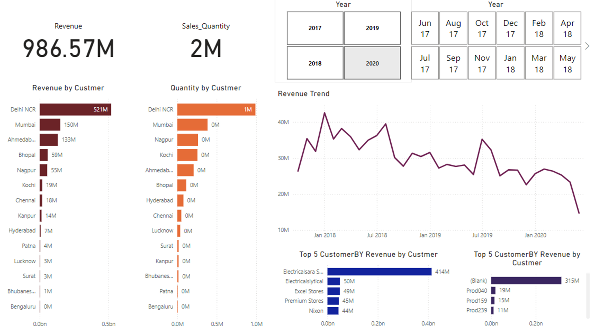

# Sales Insights Data Analysis - Power BI Project

This repository showcases a Power BI project providing sales insights through an interactive and intuitive dashboard. The dashboard is designed to visualize key business metrics, including revenue, sales quantity, and trends across different time periods and customer segments.

## Dashboard Preview

## Dashboard Features

- **Key Metrics**:
  - **Total Revenue**: 986.57M
  - **Total Sales Quantity**: 2M
- **Visualizations**:
  - **Revenue by Customer**: A bar chart displaying revenue contributions from top regions, including Delhi NCR, Mumbai, Ahmedabad, and more.
  - **Quantity by Customer**: A bar chart showing the quantity of sales across different customer regions.
  - **Revenue Trend**: A line chart depicting revenue changes over different months and years.
  - **Top 5 Customers by Revenue**: Highlights key customers and their revenue contributions.
  - **Top 5 Products by Revenue**: Shows the most profitable products and their revenue generation.

- **Interactive Filters**:
  - Yearly and monthly filters to allow for dynamic exploration of the data.
  - Flexible navigation to drill down into specific time frames and customer details.

## Technology Used

- **Tool**: Power BI
- **Skills**: Data analysis, business intelligence, interactive dashboards

## Project Highlights

- Presents a clear and concise overview of business performance with easy-to-read visuals.
- Empowers users to identify revenue trends and key contributors for informed decision-making.
- Dynamic date filters provide granular control over the data displayed.
